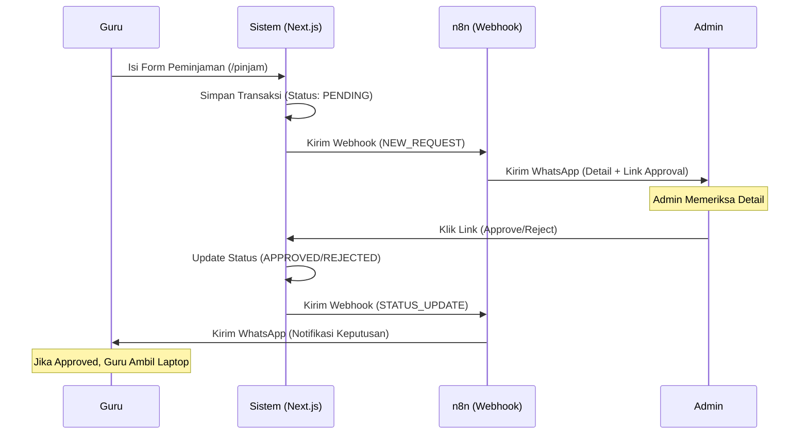

# 📦 SiPinjam Laptop — Sistem Peminjaman Laptop Sekolah

Aplikasi web untuk mengelola peminjaman laptop di lingkungan sekolah. Dibangun dengan **Next.js 16**, **Prisma 7**, **SQLite**, dan notifikasi **WhatsApp via n8n**.

---

## 🗺️ Alur Sistem



---

## 🛠️ Tech Stack

| Komponen | Teknologi |
|---|---|
| Framework | Next.js 16 (App Router) |
| Database | SQLite via Prisma 7 + better-sqlite3 |
| Auth | NextAuth.js |
| Notifikasi | n8n + GoWhatsApp (aldinokemal2104) |
| Deployment | Coolify (self-hosted) di VPS |
| Build | Nixpacks (auto-detect dari Coolify) |

---

## 🚀 Panduan Deploy ke VPS via Coolify

### Prasyarat

- VPS dengan OS Ubuntu 22.04+
- Coolify sudah terinstall di VPS ([panduan install Coolify](https://coolify.io/docs/installation))
- Repository GitHub sudah terhubung ke Coolify
- Domain/subdomain sudah diarahkan ke IP VPS

---

### Langkah 1 — Buat Aplikasi di Coolify

1. Login ke dashboard Coolify
2. Pilih **Project** → **New Resource** → **Application**
3. Pilih sumber: **GitHub Repository**
4. Pilih repo `sipinjam-laptop`, branch `main`
5. Build Pack: **Nixpacks** (otomatis terdeteksi)

---

### Langkah 2 — Environment Variables

Masuk ke tab **Environment Variables**, tambahkan:

```env
NIXPACKS_NODE_VERSION=22.12.0
DATABASE_URL=file:/app/data/dev.db
NEXTAUTH_SECRET=<random-string-min-32-karakter>
NEXTAUTH_URL=https://domain-anda.com
```

> ⚠️ **NEXTAUTH_SECRET** harus berupa string acak yang panjang dan rahasia.  
> Generate dengan: `openssl rand -base64 32`

---

### Langkah 3 — Persistent Storage (Wajib!)

Masuk ke tab **Persistent Storage** → klik **+ Add**:

| Field | Value |
|---|---|
| Name | `sipinjam-data` |
| Source Path | *(kosongkan, dikelola Docker otomatis)* |
| Destination Path | `/app/data` |

> ⚠️ **PENTING:** Jangan mount ke `/app/prisma` karena akan menimpa file schema!  
> Database disimpan di `/app/data/dev.db` yang terpisah dari source code.

---

### Langkah 4 — Deploy

1. Klik **Deploy** (atau **Redeploy** jika sudah ada)
2. Tunggu proses build selesai (~2-3 menit)
3. Pastikan status berubah menjadi **Running**

---

### Langkah 5 — Inisialisasi Database (Pertama Kali)

Masuk ke tab **Terminal** di Coolify, jalankan satu per satu:

```bash
# 1. Buat folder data
mkdir -p /app/data

# 2. Buat tabel dari migration
cd /app && npx prisma migrate deploy

# 3. Isi data awal (admin, PIN, dll)
cd /app && npx prisma db seed
```

Jika seed gagal karena container lama (node modules berbeda), gunakan script inline:

```bash
node -e "
const { PrismaClient } = require('@prisma/client');
const bcrypt = require('bcryptjs');
const { PrismaBetterSqlite3 } = require('@prisma/adapter-better-sqlite3');
const adapter = new PrismaBetterSqlite3({ url: 'file:/app/data/dev.db' });
const prisma = new PrismaClient({ adapter });
async function main() {
  const hash = await bcrypt.hash('admin123', 10);
  await prisma.admin.create({ data: { username: 'admin', password: hash } });
  await prisma.setting.createMany({ data: [
    { key: 'global_pin', value: '123456' },
    { key: 'n8n_webhook_url', value: '' }
  ]});
  console.log('Seeding Done!');
}
main().catch(console.error).finally(() => prisma.\$disconnect());
"
```

---

### Langkah 6 — Akses Aplikasi

| Halaman | URL | Keterangan |
|---|---|---|
| Publik (Guru) | `https://domain-anda.com` | PIN: `123456` |
| Form Pinjam | `https://domain-anda.com/pinjam` | Setelah login PIN |
| Login Admin | `https://domain-anda.com/login-admin` | `admin` / `admin123` |
| Dashboard Admin | `https://domain-anda.com/admin` | Setelah login |

> 🔐 **Segera ganti password dan PIN** setelah pertama kali login melalui **Admin → Settings**!

---

## 🤖 Konfigurasi n8n (Notifikasi WhatsApp)

### Install Community Node GoWhatsApp

Di n8n, masuk ke **Settings → Community Nodes → Install**:
```
@aldinokemal2104/n8n-nodes-gowa
```

### Import Workflow

1. Buka n8n → **Workflows → Import from file**
2. Pilih file `n8n_laptop_loan_workflow.json` dari repo ini
3. Konfigurasi **Credential** GoWA (Settings → Credentials)

### Konfigurasi Node di Workflow

**Node "Notify Admin (GoWA)":**
- Phone: `{{$json.phone}}`  
- Message: *(lihat template di bawah)*

**Node "Notify Teacher (GoWA)":**
- Phone: `{{$json.body.teacherPhone}}`
- Message: *(lihat template di bawah)*

### Template Pesan Admin
```
🔔 *PENGAJUAN PINJAM LAPTOP BARU*

👤 Nama: {{$json["teacherName"]}}
💻 Unit: {{$json["laptopMerk"]}}
🔢 Seri: {{$json["laptopSerial"]}}
🎨 Warna: {{$json["laptopColor"]}}
📝 Keperluan: {{$json["purpose"]}}
⏰ Waktu: {{$json["timestamp"]}}

━━━━━━━━━━━━━━━━━
✅ SETUJUI:
{{$json["approveUrl"]}}

❌ TOLAK:
{{$json["rejectUrl"]}}
━━━━━━━━━━━━━━━━━
_Link berlaku 24 jam_
```

### Template Pesan Guru
```
📋 *UPDATE STATUS PEMINJAMAN*

Halo *{{$json.body.teacherName}}*,

💻 *{{$json.body.laptopMerk}}*
🔢 Seri: {{$json.body.laptopSerial}}
🎨 Warna: {{$json.body.laptopColor}}

Status pengajuan Anda:

{{ $json.body.action == 'approve' ? '✅ *DISETUJUI*\n\nSilakan ambil unit laptop di ruang IT. Terima kasih!' : '❌ *DITOLAK*\n\n📋 Alasan: ' + ($json.body.rejectReason || '-') + '\n\nMohon hubungi Admin.' }}

_Sistem SiPinjam - Griya Quran_
```

### Hubungkan ke Aplikasi

1. Di n8n, **Activate** workflow
2. Salin **Webhook URL** (Production URL)
3. Di dashboard Admin → **Settings → n8n Webhook URL** → paste URL tersebut

---

## 🔄 Update Aplikasi

Setiap kali ada perubahan kode:

```bash
git add .
git commit -m "pesan update"
git push origin main
```

Coolify akan otomatis **Redeploy** jika auto-deploy aktif, atau klik manual **Redeploy** di dashboard Coolify.

> ✅ Data di `/app/data/dev.db` **aman** — tidak akan terhapus karena sudah di-mount sebagai Persistent Volume.

---

## 🗑️ Hapus Data Testing

Di dashboard Admin → **Peminjaman → Hapus Data per Periode**:
- Pilih tanggal awal dan akhir
- Klik **Hapus Data** → konfirmasi
- Status laptop yang sedang dipinjam akan otomatis direset ke **Tersedia**

---

## 🐛 Troubleshooting

### Build gagal: "Tailwind utility not found"
Pastikan direktif di `globals.css` menggunakan `@utility` di level atas (bukan di dalam `@layer`).

### Seed gagal: "Table does not exist"
Jalankan `npx prisma migrate deploy` terlebih dahulu sebelum seed.

### Data tidak update tanpa refresh
Sudah diperbaiki dengan `useEffect` sync di semua komponen list. Pastikan menggunakan versi terbaru.

### Logout tidak muncul di mobile
Mobile nav sekarang sudah memiliki tombol **Keluar** di posisi paling kanan.

### Container crash setelah build sukses
Cek apakah file `src/proxy.ts` mengekspor fungsi bernama `proxy` (bukan `middleware`) — wajib untuk Next.js 16+.

---

## 📁 Struktur Penting

```
sipinjam-laptop/
├── prisma/
│   ├── schema.prisma          # Definisi database
│   ├── seed.ts                # Data awal (admin, PIN)
│   └── migrations/            # Riwayat migrasi DB
├── src/
│   ├── app/
│   │   ├── admin/             # Dashboard admin
│   │   ├── api/               # REST API endpoints
│   │   │   ├── action/        # One-click approve/reject
│   │   │   ├── pinjam/        # Submit peminjaman
│   │   │   └── admin/         # CRUD admin operations
│   │   ├── pinjam/            # Form peminjaman guru
│   │   └── login-*/           # Halaman login
│   ├── components/
│   │   ├── admin/             # Sidebar & MobileNav
│   │   └── ui/                # Komponen UI reusable
│   └── lib/
│       └── prisma.ts          # Database client
├── n8n_laptop_loan_workflow.json  # Import ke n8n
└── .env.example               # Template environment variables
```

---

## 🔑 Default Credentials

| Akses | Username/PIN | Password |
|---|---|---|
| PIN Publik | `123456` | — |
| Admin | `admin` | `admin123` |

> ⚠️ Ganti segera setelah deploy pertama!

---

*Dikembangkan untuk Griya Quran — SiPinjam Laptop v2*
